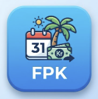

<p align="center">
  
</p>

<h1 align="center">Feriepengekalender</h1>

<p align="center">
  Norsk årskalender som beregner arbeidsdager, arbeidstimer og feriepenger.<br>
  Helligdager hentes automatisk via <a href="https://github.com/commenthol/date-holidays">date-holidays</a> og er korrekte for ethvert år.
</p>

## Funksjoner

- **Årskalender** med markering av helligdager, helger og feriepengemåned
- **Arbeidsdagberegning** med detaljert nedbrytning (hverdager - helligdager - feriedager)
- **Feriepenger** med støtte for 10,2 % / 12,0 % / 12,5 % sats
- **Månedlig inntektsoversikt** med budsjettgraf (lønn, feriepenger, lønnstrekk)
- **Arbeidsdager per måned** i sammenleggbar tabell
- Justerbar stillingsprosent, ukentlige timer og over-60-tillegg

## Tech stack

| Lag | Teknologi |
|-----|-----------|
| Framework | Next.js 16 (App Router, Turbopack) |
| Språk | TypeScript 5 |
| UI | Shadcn UI, Radix UI, Tailwind CSS 4 |
| Helligdager | date-holidays |
| Pakkebehandler | pnpm |

## Kom i gang

```bash
pnpm install
pnpm dev
```

Åpne [http://localhost:3000](http://localhost:3000).

## Prosjektstruktur

```
app/
  layout.tsx          # Root layout med Geist-fonter
  page.tsx            # Hovedside (klient-komponent)
  globals.css         # Tailwind + Shadcn CSS-variabler

components/
  budget-chart.tsx    # Månedlig inntektsgraf
  month-calendar.tsx  # Kalendervisning per måned
  workdays-table.tsx  # Sammenleggbar tabell med arbeidsdager
  ui/                 # Shadcn UI-komponenter

lib/
  holidays.ts         # Helligdager via date-holidays, arbeidsdag-beregning
  utils.ts            # cn()-hjelper (clsx + tailwind-merge)

hooks/
  use-mobile.ts       # Responsiv breakpoint-hook
  use-toast.ts        # Toast-varsler
```

## Scripts

| Kommando | Beskrivelse |
|----------|-------------|
| `pnpm dev` | Utviklingsserver med hot reload |
| `pnpm build` | Produksjonsbygg |
| `pnpm start` | Kjør produksjonsbygg |
| `pnpm lint` | Kjør ESLint |

## Lisens

Privat prosjekt.
